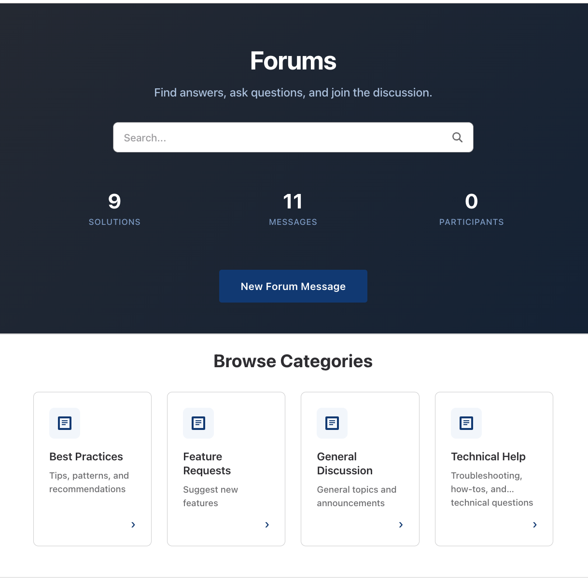
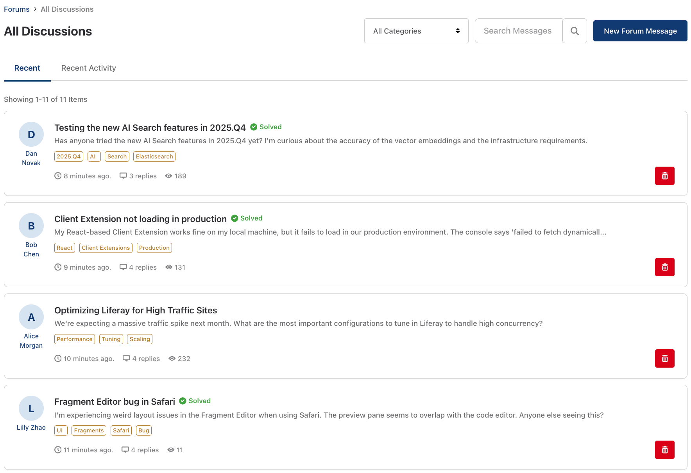
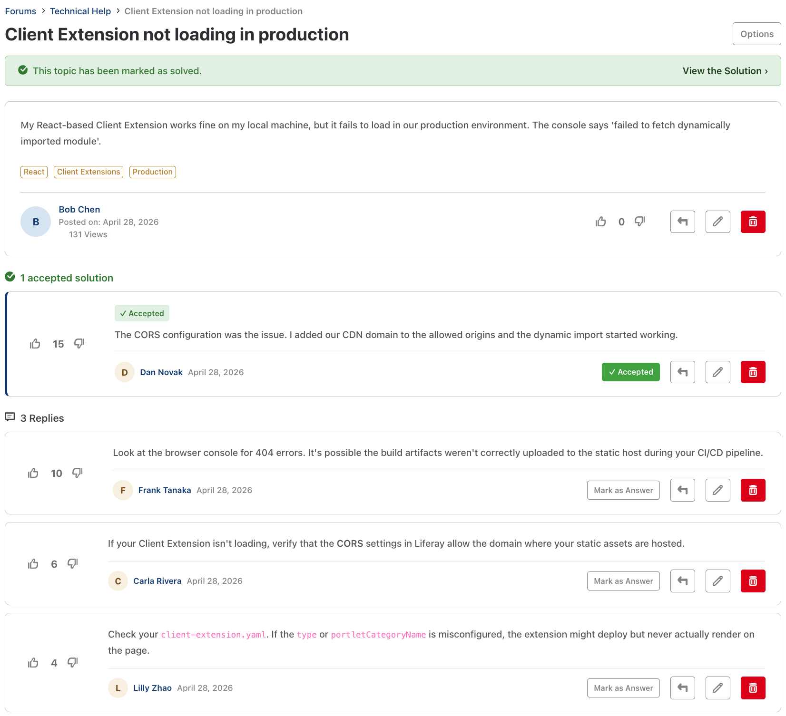

# Liferay Forums

This project is a Fragments and Liferay Objects based replacement for the legacy Message Boards / Questions widgets which are deprecated.

---

## Screenshots

<table>
  <tr>
    <td align="center"><strong>Forums Home</strong></td>
    <td align="center"><strong>Message List</strong></td>
    <td align="center"><strong>Message Detail</strong></td>
  </tr>
  <tr>
    <td><a href="screenshots/screenshot-forums.png"></a></td>
    <td><a href="screenshots/screenshot-message-list.png"></a></td>
    <td><a href="screenshots/screenshot-message-detail.png"></a></td>
  </tr>
</table>

---

## Setup

| File | Description |
| :--- | :--- |
| [forums-folder-object-definitions.json](setup/forums-folder-object-definitions.json) | Liferay Object definitions for all Forum data models (`ForumCategory`, `ForumMessage`, `ForumReply`, `ForumVote`, etc.). Import via **Control Panel → Objects → Import Object Folder**. |
| [setup-forum-permissions.groovy](setup/setup-forum-permissions.groovy) | Groovy script that grants the required Object permissions to the Guest and Site Member roles. Run via **Control Panel → Server Administration → Script**. This step is necessary because Liferay Objects has no equivalent to the `<resource-action-mapping>` XML descriptor used by Service Builder to define default permissions — Object permissions must be configured explicitly after import. The Headless REST API does not have endpoints that support this yet. It also sets up a Service Access Policy so that non-authenticated users can invoke the REST APIs in order to see forum messages and replies. |
| [Language_en_US.properties](setup/Language_en_US.properties) | Language key definitions for fragment UI strings. Import via **Control Panel → Configuration → Language Override**. |
| [delete-forum-object-definitions.py](setup/delete-forum-object-definitions.py) | Utility script that deletes all Object definitions whose name starts with `Forum` via the Object Admin REST API. Useful for resetting a dev environment. |

---

## Required Feature Flags

The following **Release** feature flags must be enabled before deploying.

| Ticket | Description |
| :--- | :--- |
| LPD-17564 | CMS |
| LPD-34594 | Root Object Definitions |
| LPD-11235 | Enhanced Rich Text Editor |

---

## Fragments

| Fragment Name | Folder | Description |
| :--- | :--- | :--- |
| **Forums Categories Admin** | [forums-categories-admin](fragments/forums-categories-admin) | Administration interface for managing forum categories. |
| **Forums Category Grid** | [forums-category-grid](fragments/forums-category-grid) | Displays the main forum categories in a grid layout. |
| **Forums Hero** | [forums-hero](fragments/forums-hero) | Top banner for the forums featuring statistics (like member count) and quick actions. |
| **Forums Moderation** | [forums-moderation](fragments/forums-moderation) | Tools for moderating forum content. |
| **Forums Message Composer** | [forums-message-composer](fragments/forums-message-composer) | Modal composer for creating and editing forum messages and replies. |
| **Forums Related Topics** | [forums-related-topics](fragments/forums-related-topics) | Displays a list of topics related to the currently viewed message. |
| **Forums Message Detail** | [forums-message-detail](fragments/forums-message-detail) | Detailed view of a single forum message, including its replies and engagement metrics. |
| **Forums Message List** | [forums-message-list](fragments/forums-message-list) | Lists forum messages, typically used for main category views or recent activity. |

---

## Page Layout and Fragment Placement

The forums application is assembled using a combination of standard pages and Display Page Templates. The site initializer creates the standard pages described below automatically — they are defined in `site-initializer/layouts/`. The layout diagrams serve as a preview of how the fragments are arranged on those auto-created pages.

### Page: Forums
*Friendly URL: `/forums` — Main entry point for the forums.*
```
┌─────────────────────────────────────────────────────────────────┐
│  forums-hero                                                    │
│  ┌───────────────────────────────────────────────────────────┐  │
│  │  drop-zone → Search Bar widget                            │  │
│  └───────────────────────────────────────────────────────────┘  │
├─────────────────────────────────────────────────────────────────┤
│  forums-category-grid                                           │
└─────────────────────────────────────────────────────────────────┘
```

> After placing the **Search Bar** widget in the `forums-hero` drop-zone, configure it with the destination search page and any other relevant search settings (scope, placeholder text, etc.).

### Page: Forums Messages
*Friendly URL: `/forums-messages` — Hide from page navigation.*
```
┌─────────────────────────────────────────────────────────────────┐
│  forums-message-list                                            │
├─────────────────────────────────────────────────────────────────┤
│  forums-message-composer                                        │
└─────────────────────────────────────────────────────────────────┘
```

### Page: Forum Categories Admin
*Friendly URL: `/forum-categories-admin` — Restrict access to the Administrator role.*
```
┌─────────────────────────────────────────────────────────────────┐
│  forums-categories-admin                                        │
└─────────────────────────────────────────────────────────────────┘
```

### Page: Forums Moderation
*Friendly URL: `/forums-moderation` — Restrict access to the Administrator role.*
```
┌─────────────────────────────────────────────────────────────────┐
│  forums-moderation                                              │
└─────────────────────────────────────────────────────────────────┘
```

---

## Display Page Templates

The site initializer creates two Display Page Templates automatically — one mapped to `ForumMessage`, one mapped to `ForumReply`. Both use the identical fragment arrangement described below and are defined in `site-initializer/layout-page-templates/display-page-templates/`.

> **How Object Definition resolution works:** Liferay's raw Display Page Template export bakes in a volatile internal ID suffix (e.g. `com.liferay.object.model.ObjectDefinition#A0Z2`) as the `contentType.className`, which breaks on re-import whenever Object Definitions are recreated. The site initializer avoids this by using `BundleSiteInitializer`'s token replacement system. When Object Definitions are created during initialization, the method `_replaceObjectDefinitionValues` registers tokens like `OBJECT_DEFINITION_CLASS_NAME:ForumMessage` → `com.liferay.object.model.ObjectDefinition#xxxx`. The `display-page-template.json` uses these tokens:
> ```json
> {"contentType": {"className": "[$OBJECT_DEFINITION_CLASS_NAME:ForumMessage$]"}, "name": "Forum Message"}
> ```
> The `[$...$]` tokens are resolved at runtime before the layout importer processes the file, so the correct `className` (including its instance-specific `#suffix`) is always injected.

### Layout

Both Display Page Templates share the same structure:

```
┌─────────────────────────────────────────────────────────────────┐
│  Container                                                      │
│  ┌───────────────────────────────────────┬───────────────────┐  │
│  │  Column — 75%                         │  Column — 25%     │  │
│  │                                       │                   │  │
│  │  ┌─────────────────────────────────┐  │  ┌─────────────┐  │  │
│  │  │  forums-message-detail          │  │  │   forums-   │  │  │
│  │  └─────────────────────────────────┘  │  │  related-   │  │  │
│  │  ┌─────────────────────────────────┐  │  │   topics    │  │  │
│  │  │  forums-message-composer        │  │  └─────────────┘  │  │
│  │  └─────────────────────────────────┘  │                   │  │
│  └───────────────────────────────────────┴───────────────────┘  │
└─────────────────────────────────────────────────────────────────┘
```

Inside the Container, a **2-column Grid** with a **75% / 25%** split:
- **Left column:** `forums-message-detail`, then `forums-message-composer`
- **Right column:** `forums-related-topics`

> **Important:** `forums-message-composer` must be present in every Display Page Template. Without it, users have no way to edit or reply to a message, because the composer modal is the sole entry point for both actions.

### ERC Field Mapping

The `forums-message-detail` and `forums-related-topics` fragments each contain hidden `div` elements that appear as mappable fields in the page editor but are not rendered to end-users at runtime. The site initializer's `page-definition.json` files pre-configure these mappings.

```html
<!-- Exposed as mappable fields in the Content Page Editor; hidden at runtime -->
<div id="forumsDetailERC"      data-lfr-editable-id="forumsDetailERC"      data-lfr-editable-type="text" style="display:none;">Mappable Message ERC</div>
<div id="forumsDetailReplyERC" data-lfr-editable-id="forumsDetailReplyERC" data-lfr-editable-type="text" style="display:none;">Mappable Reply ERC</div>
```

Each field is mapped to `ObjectEntry_externalReferenceCode` from the `DisplayPageItem` context, but only in the DPT that corresponds to its object type:

| Field | Forum Message DPT | Forum Reply DPT |
| :--- | :--- | :--- |
| **Mappable Message ERC** | Map to `ForumMessage → externalReferenceCode` | Leave unmapped |
| **Mappable Reply ERC** | Leave unmapped | Map to `ForumReply → externalReferenceCode` |

---

## Demo Data

The `setup/demo/` directory contains scripts for populating and clearing forum content in a development environment.

### Import

```bash
python3 setup/demo/create-demo-data.py <siteId> [BASE_URL] [--email EMAIL] [--password PASSWORD]
```

The script creates the four default Forum Categories (by ERC if they do not already exist), a set of demo user accounts assigned the Site Member role, a set of Forum Messages with keywords distributed across those categories, and replies to each message authored by different users.

| Argument | Default | Description |
| :--- | :--- | :--- |
| `siteId` | *(required)* | Site (group) ID to scope all entries to |
| `BASE_URL` | `http://localhost:8080` | Liferay portal base URL |
| `--email` | `test@liferay.com` | Admin account email |
| `--password` | `test` | Admin account password |

### Delete

```bash
python3 setup/demo/delete-demo-data.py <siteId> [BASE_URL] [--email EMAIL] [--password PASSWORD]
```

Deletes all Forum Reply and Forum Message entries for the given site. Forum Votes are removed automatically via cascade. Forum Categories and the demo user accounts are left in place.

The arguments are identical to the import script above.

---

## Utilities

| File | Description |
| :--- | :--- |
| [delete-forum-stats-users.py](setup/delete-forum-stats-users.py) | Deletes all `ForumStatsUser` entries via the Objects REST API. Run this before executing `backfill-forum-stats-users.groovy` to ensure no duplicate records. Accepts an optional `--scope` argument (site `groupId` or friendly URL); if omitted the script auto-detects the correct scope. Usage: `python3 setup/delete-forum-stats-users.py [BASE_URL] [--scope SCOPE] [--email EMAIL] [--password PASSWORD]` |
| [backfill-forum-stats-users.groovy](setup/backfill-forum-stats-users.groovy) | Backfills `ForumStatsUser` records for every user who has posted a message or reply. Required when those records are missing after a data import, or for users who posted before the auto-creation logic existed — without them, the `forums-hero` fragment displays 0 Members. Run via **Control Panel → Server Administration → Script** after clearing existing records with `delete-forum-stats-users.py`. |

---

## Known Limitations

### View Count Not Incremented for Guest Users

The `forums-message-detail` fragment PATCHes the `viewCount` field on `ForumMessage` objects only for authenticated users. Guest views are silently skipped because the Liferay Object REST API returns `403 Forbidden` for unauthenticated PATCH requests.

**Option:** Grant the Guest role `update` permission on ForumMessage objects via the Object's permissions configuration. However, the preferred solution is a dedicated endpoint in a Spring Boot Client Extension that accepts a `messageId` and increments `viewCount` with its own service credentials — keeping the Object's permissions locked down.

### Ban Enforcement Is UI-Only

When a user is banned (a `ForumBan` Object entry exists for their user ID in the site scope), the fragments detect this at page load by querying `GET /o/c/forumbans/scopes/{groupId}?filter=banUserId eq {userId}`. If a ban is found, the UI is locked down: the submit button is disabled, compose buttons are hidden, and an inline warning is shown. This is purely client-side — the REST endpoints that create and update content (`POST /o/c/forummessages/`, `POST /o/c/forumreplies/`, `PATCH /o/c/forummessages/{id}`, `PATCH /o/c/forumreplies/{id}`) have no knowledge of the `ForumBan` collection and will accept requests from a banned user if called directly.

**Why the legacy portlets don't have this gap:** The legacy Message Boards portlets enforce bans at the Liferay permission framework layer (`MBPortletResourcePermissionLogic`), which calls `MBBanLocalService.hasBan()` on every permission check regardless of the calling path (web UI, REST API, or direct service invocation). Custom Liferay Objects have no equivalent hook into that permission logic.

**Why this can't be fixed with built-in Object features:** Object Actions all fire after the entry is already committed (there is no pre-create trigger that can abort creation). Object Validation rules use the Expression Builder, which is limited to the entry's own field values and cannot query other Object collections or access current user context. Groovy script actions — which could perform the check — are not available on Liferay SaaS.

**The only realistic server-side option: Microservice Client Extension**

A Spring Boot Microservice Client Extension can be registered as an Object Action webhook on both `ForumMessage` and `ForumReply`, triggered on the `On After Add` event. It would:

1. Receive the Object Action payload, which includes the `creatorId` (the user ID of the entry author) and the `groupId` (site scope).
2. Call `GET /o/c/forumbans/scopes/{groupId}?filter=banUserId eq {creatorId}&pageSize=1` using service credentials to check for a ban record.
3. If a ban record exists, immediately call `DELETE /o/c/forummessages/{entryId}` or `DELETE /o/c/forumreplies/{entryId}` to remove the entry.

There is an unavoidable brief window (milliseconds to low seconds depending on load) between the entry being created and the microservice deleting it. In practice this is acceptable given that banning is rare and the moderation fragment provides a backstop for any content that appears during that window.

### "Top Replies" Implemented as "Recent Activity"

The "Recent Activity" tab (formerly "Top Replies") sorts messages using `lastPostDate:desc`. This functions as a "Recently Active" feed rather than filtering for the highest volume of total replies. A new message with 1 reply will surface above an older message with 100 replies.

**Option:** If a true "Top Replied" filter is desired, the sorting criteria must be changed to target a `replyCount` metric. The Liferay Object definition would need an aggregated integer field for total replies that can be passed to the OData `sort` parameter (e.g., `sort=replyCount:desc`), or rely on a Client Extension to dynamically aggregate and sort this information.
